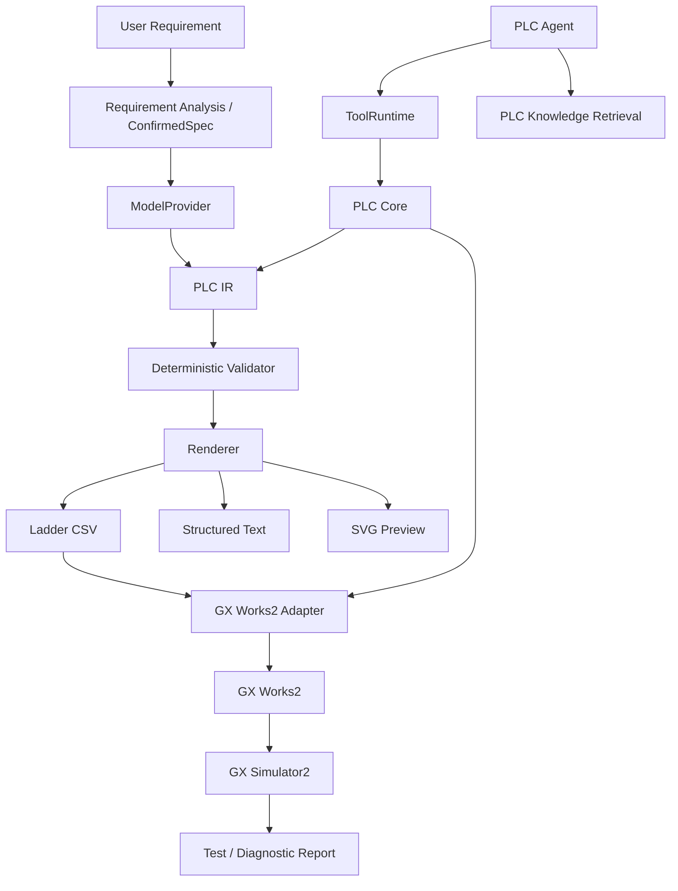

# GX Works2 Openness MCP

English | [简体中文](README.zh-CN.md)

> AI-assisted engineering workbench for Mitsubishi GX Works2.  
> **Natural language → PLC logic → validation → GX Works2 → simulation.**


GX Works2 Openness MCP is an experimental AI engineering layer for Mitsubishi MELSEC PLCs.

Instead of asking an LLM to directly output PLC code and hoping it works, the project builds a complete engineering pipeline around the model:

```text
Natural Language
      ↓
Requirement Clarification
      ↓
Confirmed Control Spec
      ↓
PLC IR
      ↓
Deterministic Validation
      ↓
Ladder / ST
      ↓
GX Works2
      ↓
GX Simulator2
      ↓
Test / Diagnose / Repair
```

The current demo focuses on **FX3U + GX Works2**.

> [!IMPORTANT]
> `Openness` here means providing a programmable engineering interface around GX Works2.
> This project does **not** use or claim to provide an official Mitsubishi Electric "Openness API".

---

## Why?

Modern AI agents are increasingly capable of working with engineering software through structured tools.

GX Works2, however, was not designed around agentic workflows.

This project tries to bridge that gap.

The goal is not:

```text
Prompt → LLM → PLC code
```

but:

```text
AI reasoning
    +
structured PLC state
    +
deterministic validation
    +
engineering tools
    +
simulation feedback
```

so that PLC generation and modification can become inspectable, incremental and verifiable.

---

## Features

### Natural Language PLC Engineering

Describe the control behavior you want:

```text
X0 starts the motor.
X1 stops it.
Y0 drives the motor contactor.

Use a holding circuit.
Stop must have priority.
After X2 detects a workpiece, stop after 3 seconds.
The motor must not automatically restart after power recovery.
```

The system can:

- clarify incomplete control requirements
- build a confirmed control specification
- generate Ladder or ST
- modify existing programs
- analyze existing logic
- diagnose problems
- propose targeted repairs

### PLC Intermediate Representation

LLM output is not treated as the final engineering artifact.

Programs are converted into an internal **PLC IR**:

```text
             ┌─ Ladder CSV
             ├─ ST
AI → PLC IR ─┼─ SVG Preview
             ├─ Validation
             └─ GX Works2
```

The IR provides a stable semantic layer for:

- Networks
- Instructions
- Devices
- Read / write dependencies
- Incremental patches
- Program revisions
- Static analysis
- Diff
- Deterministic rendering

This also provides the foundation for future:

```text
Structured Ladder / FBD
GX Works3
Other PLC platforms
```

### Deterministic Validation

The model is not responsible for judging whether its own output is correct.

Generated programs are checked locally for issues such as:

- instruction structure
- device validity
- I/O references
- timers and counters
- network structure
- read/write dependencies
- PLC-specific constraints
- control-spec consistency
- common ladder logic problems

```text
LLM
 ↓
PLC IR
 ↓
Validator
 ↓
Pass ─────→ Render / Import
 ↓
Fail
 ↓
Repair
```

> **LLM for reasoning. Deterministic code for verification.**

### GX Works2 Integration

The current Ladder workflow uses GX Works2 CSV import/export as a reliable engineering interface.

Supported workflows include:

- program CSV generation
- device comment CSV generation
- GX Works2 import
- GX Works2 export
- program synchronization
- comment synchronization
- automatic backup before overwrite
- synchronization baselines
- external modification detection
- conflict protection
- optional round-trip verification

```text
PLC AI
   ↓
Generate CSV
   ↓
Backup GX Works2
   ↓
Check Sync Baseline
   ↓
Import
   ↓
Read Back
   ↓
Verify
```

If the project detects that the GX Works2 program has been manually modified since the previous synchronization, it stops instead of silently overwriting the changes.

### Incremental Editing

Existing PLC programs do not have to be regenerated from scratch.

The Agent can create targeted patches:

```text
Current PLC IR
      ↓
Network Patch
      ↓
Candidate Version
      ↓
Validation
      ↓
Diff
      ↓
User Confirmation
      ↓
Commit
```

This makes requests such as:

```text
Change the stop logic to stop-priority.

Do not modify the other networks.
```

possible without rebuilding the whole program.

### PLC Tool Agent

The project includes a vendor-neutral Agent / Tool boundary.

The model interacts with high-level engineering tools such as:

```text
get_current_project
get_current_program_info
read_network
search_plc_manual
get_diagnostics
validate_project
compile_project
patch_program
validate_current_program
import_current_program_to_gxworks2
```

The model does **not** directly receive low-level primitives such as:

```text
mouse_click
keyboard_input
delete_file
write_plc
force_device
```

Engineering state changes remain behind controlled application boundaries.

### GX Simulator2 Automated Testing

The project can generate a simulation test plan from the current PLC program and execute it through GX Simulator2.

```text
PLC Program
    ↓
AI Test Planning
    ↓
User Confirmation
    ↓
GX Simulator2
    ↓
Input Sequence
    ↓
Assertions
    ↓
Test Report
```

The local simulator gateway is intentionally isolated from physical PLCs.

Current design:

- localhost only
- process-specific authentication token
- fixed GX Simulator2 target
- controlled device writes
- no physical PLC connection path

See [`simulator_gateway/README.md`](simulator_gateway/README.md).

---

## Model Support

The built-in Agent uses a vendor-neutral `ModelProvider` abstraction.

Current support:

| Provider | Status |
| --- | --- |
| DeepSeek | ✅ |
| Zhipu GLM | ✅ |
| Custom OpenAI-compatible API | ✅ |
| Anthropic native API | 🚧 Planned |
| Gemini native API | 🚧 Planned |
| Codex Harness / App Server | 🚧 Planned |

DeepSeek and Zhipu currently share the same OpenAI-compatible transport layer rather than separate provider implementations.

API keys are stored in the Windows Credential Manager instead of the repository configuration.

---

## MCP

The current codebase already has an MCP-shaped Tool Runtime:

```text
Built-in Agent
      ↓
 ModelProvider
      ↓
 ToolRuntime
      ↓
   PLC Core
      ↓
GX Works2 Adapter
```

Tools use structured schemas and canonical ToolCall / ToolResult objects.

The next step is exposing this Tool Runtime as a standalone MCP server:

```text
Codex ────────────┐
Claude Code ──────┤
DeepSeek Harness ─┼→ GX Works2 MCP → PLC Core → GX Works2
Other Agents ─────┘
```

Planned transports:

- stdio
- Streamable HTTP

> The current release does not yet expose a standalone MCP server for external MCP clients.

---

## Architecture



---

## Quick Start

### Requirements

Recommended:

- Windows 10 / 11
- Python
- GX Works2
- DeepSeek, Zhipu or another OpenAI-compatible API

Optional for automated simulation:

- GX Simulator2
- MX Component

GX Works2, GX Simulator2 and MX Component are proprietary Mitsubishi Electric software and are not included in this repository.

### Install

```powershell
git clone https://github.com/Arienax/GX-Works2_Openness_MCP.git
cd GX-Works2_Openness_MCP

python -m venv .venv
.\.venv\Scripts\Activate.ps1

pip install -r requirements.txt

python src\main.py
```

Run tests:

```powershell
pytest -q
```

A separate dependency set is also provided for Windows 7:

```powershell
pip install -r requirements-win7.txt
```

---

## Project Structure

```text
src/
├─ main.py
│  Desktop engineering workbench
│
├─ model_provider.py
│  Vendor-neutral model abstraction
│
├─ plc_agent.py
│  Tool-calling PLC Agent
│
├─ plc_agent_tools.py
│  Engineering tool definitions
│
├─ tool_runtime.py
│  MCP-shaped tool boundary
│
├─ plc_core.py
│  Model-independent PLC operations
│
├─ plc_ir.py
│  PLC IR / Patch / Validation / Hash
│
├─ plc_json_validator.py
│  Deterministic PLC validation
│
├─ knowledge_retriever.py
│  PLC manual / knowledge retrieval
│
└─ gxworks2/
   ├─ csv_manager.py
   ├─ import_service.py
   ├─ sync_service.py
   ├─ simulation.py
   └─ ui_automation.py

simulator_gateway/
└─ Local GX Simulator2 gateway

resources/
├─ knowledge/
├─ pattern_library.json
└─ plc_models.json
```

---

## Roadmap

- [ ] Standalone MCP Server
- [ ] Codex Harness / App Server integration
- [ ] DeepSeek Harness integration
- [ ] Structured Ladder / FBD
- [ ] Function / Function Block
- [ ] Reusable FB Library
- [ ] More complete compile / diagnose / repair loop
- [ ] More MELSEC PLC families
- [ ] GX Works3 adapter
- [ ] Vendor-neutral PLC backend
- [ ] HMI / wider automation-project model

---

## Current Status

This project is still under active development.

Current limitations:

- primarily developed and tested around FX3U
- Ladder CSV integration is currently the most mature backend
- Structured Ladder / FBD is not implemented yet
- standalone MCP transport is not implemented yet
- GX Works2 GUI automation may depend on software version, language and window state
- simulator validation does not replace real machine commissioning

---

## Safety

PLC software controls physical equipment.

Generated logic should be reviewed by qualified engineers before deployment to real machinery.

Particular attention should be paid to:

- emergency stop circuits
- mechanical interlocks
- limit switches
- homing
- fail-safe behavior
- startup states
- motion collision risks
- drive / servo parameters

---

## License

Licensed under the [Apache License 2.0](LICENSE).

---

## Disclaimer

This is an independent open-source project and is **not affiliated with, sponsored by, or endorsed by Mitsubishi Electric**.

Mitsubishi Electric, MELSEC, GX Works2, GX Simulator2 and MX Component are trademarks or product names of their respective owners.
