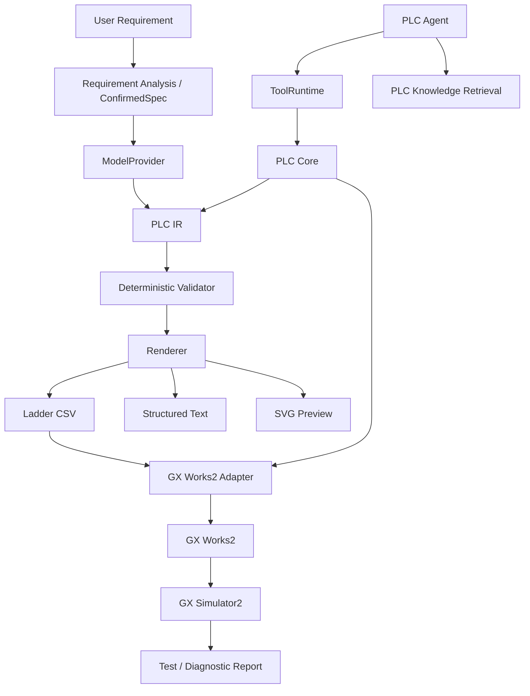

# GX Works2 Openness MCP

English | [简体中文](README.zh-CN.md)

> AI-assisted engineering workbench for Mitsubishi GX Works2, with an MCP-ready structured tool runtime.  
> **Natural language → confirmed control spec → PLC IR → deterministic validation → GX Works2 → simulation.**


GX Works2 Openness MCP is an experimental AI engineering layer for Mitsubishi MELSEC PLCs. It is designed to make PLC generation and modification inspectable, incremental, and verifiable instead of treating raw LLM output as the final engineering artifact.

```text
Natural Language
      ↓
Requirement Clarification
      ↓
Confirmed Control Spec
      ↓
PLC IR
      ↓
Deterministic Validation
      ↓
Ladder / ST
      ↓
GX Works2
      ↓
GX Simulator2
      ↓
Test / Diagnose / Repair
```

The current demo focuses on **FX3U + GX Works2**.

> [!IMPORTANT]
> `Openness` here means providing a programmable engineering interface around GX Works2.
> This project does **not** use or claim to provide an official Mitsubishi Electric "Openness API".

> [!NOTE]
> The repository already contains an MCP-shaped structured Tool Runtime, but the current release does **not yet expose a standalone MCP server** for external MCP clients. Standalone stdio / Streamable HTTP transport is under development.

<!-- Add the project demo GIF here when available. -->

---

## Capability Status

| Capability | Status |
| --- | --- |
| Natural-language requirement analysis | ✅ Working |
| Confirmed control specification | ✅ Working |
| PLC Intermediate Representation (PLC IR) | ✅ Working |
| Deterministic PLC validation | ✅ Working |
| Ladder CSV generation | ✅ Working |
| GX Works2 CSV import / export | ✅ Working |
| Program and comment synchronization | ✅ Working |
| Incremental network patching / diff | ✅ Working |
| FX3U manual knowledge retrieval | ✅ Working |
| Structured Text generation | 🧪 Experimental |
| GX Simulator2 automated testing | 🧪 Experimental |
| Standalone MCP server | 🚧 In development |
| Structured Ladder / FBD | 📋 Planned |
| GX Works3 adapter | 📋 Planned |

---

## Quick Start

### Requirements

Core / desktop workbench:

- Windows 10 / 11
- Python
- DeepSeek, Zhipu GLM, or another OpenAI-compatible API

For GX Works2 integration:

- GX Works2

Optional for automated simulation:

- GX Simulator2
- MX Component

GX Works2, GX Simulator2, and MX Component are proprietary Mitsubishi Electric software and are not included in this repository.

### Install

```powershell
git clone https://github.com/Arienax/gx-works2-mcp.git
cd gx-works2-mcp

python -m venv .venv
.\.venv\Scripts\Activate.ps1

pip install -r requirements.txt
python src\main.py
```

Run tests:

```powershell
pytest -q
```

A separate dependency set is also provided for Windows 7:

```powershell
pip install -r requirements-win7.txt
```

API keys are stored in the Windows Credential Manager instead of the repository configuration.

---

## Example

Describe the required control behavior:

```text
X0 starts the motor.
X1 stops it.
Y0 drives the motor contactor.

Use a holding circuit.
Stop must have priority.
After X2 detects a workpiece, stop after 3 seconds.
The motor must not automatically restart after power recovery.
```

The intended workflow is not:

```text
Prompt → LLM → PLC code
```

Instead, the model works through structured engineering state:

```text
AI reasoning
    +
confirmed control specification
    +
PLC IR
    +
deterministic validation
    +
engineering tools
    +
simulation feedback
```

The Agent can clarify incomplete requirements, generate Ladder or ST, inspect existing logic, create targeted patches, validate candidate revisions, and diagnose problems.

---

## Core Design

### PLC Intermediate Representation

LLM output is converted into an internal **PLC IR** rather than being treated as the final program.

```text
             ┌─ Ladder CSV
             ├─ ST
AI → PLC IR ─┼─ SVG Preview
             ├─ Validation
             └─ GX Works2
```

The IR provides a stable semantic layer for networks, instructions, devices, read/write dependencies, revisions, static analysis, diffs, incremental patches, and deterministic rendering.

### Deterministic Validation

The model is not responsible for judging whether its own output is correct. Generated programs are checked locally for issues such as:

- instruction structure
- device validity
- I/O references
- timers and counters
- network structure
- read/write dependencies
- PLC-specific constraints
- control-spec consistency
- common ladder logic problems

```text
LLM → PLC IR → Validator → Pass → Render / Import
                        ↓
                       Fail
                        ↓
                      Repair
```

> **LLM for reasoning. Deterministic code for verification.**

### GX Works2 Integration

The current Ladder workflow uses GX Works2 CSV import / export as the most mature engineering interface.

Supported workflows include program and device-comment CSV generation, import / export, synchronization, automatic backup before overwrite, synchronization baselines, external modification detection, conflict protection, and optional round-trip verification.

If the project detects that the GX Works2 program has been manually modified since the previous synchronization, it stops instead of silently overwriting the changes.

### Incremental Editing

Existing programs do not have to be regenerated from scratch.

```text
Current PLC IR
      ↓
Network Patch
      ↓
Candidate Version
      ↓
Validation
      ↓
Diff
      ↓
User Confirmation
      ↓
Commit
```

This allows requests such as:

```text
Change the stop logic to stop-priority.
Do not modify the other networks.
```

### Controlled Tool Boundary

The built-in Agent interacts with high-level engineering tools such as:

```text
get_current_project
get_current_program_info
read_network
search_plc_manual
get_diagnostics
validate_project
compile_project
patch_program
validate_current_program
import_current_program_to_gxworks2
```

Low-level primitives such as arbitrary mouse input, file deletion, physical PLC writes, or forced device writes are not directly exposed to the model. Engineering state changes remain behind controlled application boundaries.

### GX Simulator2 Automated Testing

The project can generate a simulation test plan from the current PLC program and execute it through GX Simulator2.

```text
PLC Program
    ↓
AI Test Planning
    ↓
User Confirmation
    ↓
GX Simulator2
    ↓
Input Sequence
    ↓
Assertions
    ↓
Test Report
```

The local simulator gateway is intentionally isolated from physical PLCs. Its current design uses localhost-only access, a process-specific authentication token, a fixed GX Simulator2 target, controlled device writes, and no physical PLC connection path.

See [`simulator_gateway/README.md`](simulator_gateway/README.md).

---

## FX3U Knowledge Retrieval

The Agent includes local retrieval for FX3U manuals and engineering knowledge, including instruction lookup, device constraints, and troubleshooting.

The repository contains a 220-case retrieval benchmark under [`benchmarks/`](benchmarks/):

| Metric | Result |
| --- | ---: |
| Cases | 220 |
| Recall@1 | 86.27% |
| Recall@5 | 98.04% |
| Recall@10 | 100% |
| MRR | 0.9033 |
| Negative accuracy | 100% |
| Mean latency | 58.2 ms |

See [`benchmarks/fx3u_rag_benchmark_report.json`](benchmarks/fx3u_rag_benchmark_report.json) for the current report.

> These are project-internal retrieval benchmarks. They measure knowledge retrieval performance, not end-to-end PLC program correctness or real-machine safety.

---

## Model Support

The built-in Agent uses a vendor-neutral `ModelProvider` abstraction.

| Provider | Status |
| --- | --- |
| DeepSeek | ✅ |
| Zhipu GLM | ✅ |
| Custom OpenAI-compatible API | ✅ |
| Anthropic native API | 🚧 Planned |
| Gemini native API | 🚧 Planned |
| Codex Harness / App Server | 🚧 Planned |

DeepSeek and Zhipu currently share the same OpenAI-compatible transport layer rather than separate provider implementations.

---

## MCP

The current codebase has an MCP-shaped Tool Runtime:

```text
Built-in Agent
      ↓
 ModelProvider
      ↓
 ToolRuntime
      ↓
   PLC Core
      ↓
GX Works2 Adapter
```

Tools use structured schemas and canonical ToolCall / ToolResult objects.

The next step is exposing this Tool Runtime as a standalone MCP server:

```text
Codex ────────────┐
Claude Code ──────┤
DeepSeek Harness ─┼→ GX Works2 MCP → PLC Core → GX Works2
Other Agents ─────┘
```

Planned transports:

- stdio
- Streamable HTTP

---

## Architecture



### Technology Overview

- Core / UI: Python, PyQt6
- Packaging: PyInstaller
- PLC integration: GX Works2 CSV, pywinauto
- Simulation: GX Simulator2, MX Component, local C# gateway
- Knowledge retrieval: SQLite FTS5, BM25, dense retrieval, hybrid reranking
- LLM integration: vendor-neutral `ModelProvider` with OpenAI-compatible transport

---

## Project Structure

```text
src/
├─ main.py                  Desktop engineering workbench
├─ model_provider.py        Vendor-neutral model abstraction
├─ plc_agent.py             Tool-calling PLC Agent
├─ plc_agent_tools.py       Engineering tool definitions
├─ tool_runtime.py          MCP-shaped tool boundary
├─ plc_core.py              Model-independent PLC operations
├─ plc_ir.py                PLC IR / Patch / Validation / Hash
├─ plc_json_validator.py    Deterministic PLC validation
├─ knowledge_retriever.py   PLC manual / knowledge retrieval
└─ gxworks2/                GX Works2 integration

simulator_gateway/          Local GX Simulator2 gateway
resources/                  PLC models, patterns, and knowledge resources
examples/                   GX Works2 CSV examples
benchmarks/                 FX3U retrieval benchmarks and reports
docs/                       Design and research documentation
```

---

## Roadmap

- [ ] Standalone MCP Server
- [ ] Codex Harness / App Server integration
- [ ] DeepSeek Harness integration
- [ ] Structured Ladder / FBD
- [ ] Function / Function Block
- [ ] Reusable FB Library
- [ ] More complete compile / diagnose / repair loop
- [ ] More MELSEC PLC families
- [ ] GX Works3 adapter
- [ ] Vendor-neutral PLC backend
- [ ] HMI / wider automation-project model

---

## Current Limitations

This project is still under active development.

- primarily developed and tested around FX3U
- Ladder CSV integration is currently the most mature backend
- Structured Text and simulator automation are still experimental
- Structured Ladder / FBD is not implemented yet
- standalone MCP transport is not implemented yet
- GX Works2 GUI automation may depend on software version, language, and window state
- simulator validation does not replace real-machine commissioning

---

## Safety

PLC software controls physical equipment. Generated logic should be reviewed by qualified engineers before deployment to real machinery.

Particular attention should be paid to emergency-stop circuits, mechanical interlocks, limit switches, homing, fail-safe behavior, startup states, motion collision risks, and drive / servo parameters.

---

## License

Licensed under the [Apache License 2.0](LICENSE).

---

## Disclaimer

This is an independent open-source project and is **not affiliated with, sponsored by, or endorsed by Mitsubishi Electric**.

Mitsubishi Electric, MELSEC, GX Works2, GX Simulator2, and MX Component are trademarks or product names of their respective owners.
