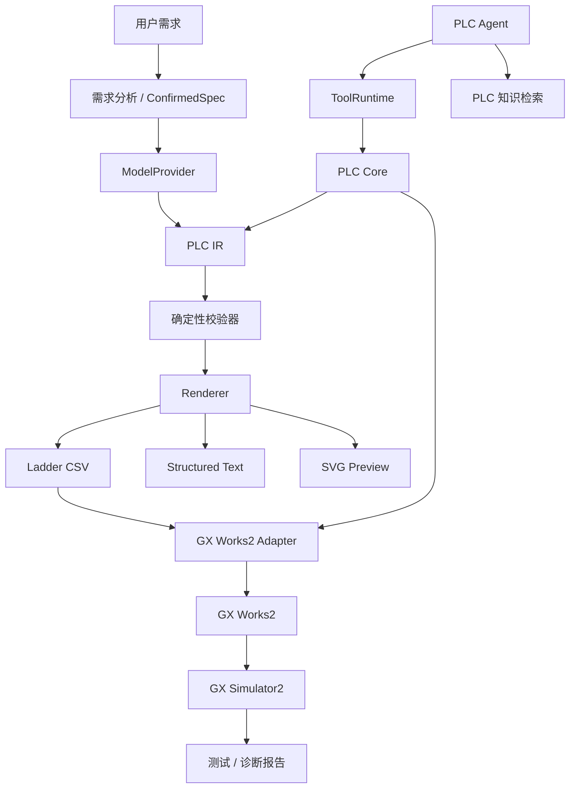

# GX Works2 Openness MCP

[English](README.md) | 简体中文

> 面向 Mitsubishi GX Works2 的 AI 辅助工程工作台，并提供 MCP-ready 的结构化 Tool Runtime。  
> **自然语言 → 已确认控制规格 → PLC IR → 确定性校验 → GX Works2 → 仿真。**


GX Works2 Openness MCP 是一个面向 Mitsubishi MELSEC PLC 的实验性 AI 工程层。它的目标不是把 LLM 原始输出直接当成最终 PLC 程序，而是让 PLC 程序的生成与修改具备可检查、可增量修改、可验证的工程链路。

```text
自然语言需求
      ↓
需求澄清
      ↓
已确认控制规格
      ↓
PLC IR
      ↓
确定性校验
      ↓
Ladder / ST
      ↓
GX Works2
      ↓
GX Simulator2
      ↓
测试 / 诊断 / 修复
```

当前 Demo 主要聚焦于 **FX3U + GX Works2**。

> [!IMPORTANT]
> 这里的 `Openness` 指的是在 GX Works2 周围建立可编程的开放工程接口。
> 本项目**并不使用，也不声称提供 Mitsubishi Electric 官方的“Openness API”**。

> [!NOTE]
> 当前仓库已经包含 MCP 风格的结构化 Tool Runtime，但当前版本**尚未向外部 MCP Client 暴露独立的标准 MCP Server**。stdio / Streamable HTTP Transport 仍在开发中。

<!-- Demo GIF 做好后放在这里。 -->

---

## 功能状态

| 能力 | 状态 |
| --- | --- |
| 自然语言需求分析 | ✅ 可用 |
| 已确认控制规格 | ✅ 可用 |
| PLC Intermediate Representation（PLC IR） | ✅ 可用 |
| 确定性 PLC 校验 | ✅ 可用 |
| Ladder CSV 生成 | ✅ 可用 |
| GX Works2 CSV 导入 / 导出 | ✅ 可用 |
| 程序与注释同步 | ✅ 可用 |
| Network 增量 Patch / Diff | ✅ 可用 |
| FX3U 手册知识检索 | ✅ 可用 |
| Structured Text 生成 | 🧪 实验性 |
| GX Simulator2 自动化测试 | 🧪 实验性 |
| 独立 MCP Server | 🚧 开发中 |
| Structured Ladder / FBD | 📋 计划中 |
| GX Works3 Adapter | 📋 计划中 |

---

## 快速开始

### 环境要求

核心 / 桌面工作台：

- Windows 10 / 11
- Python
- DeepSeek、智谱 GLM 或其他 OpenAI-compatible API

如需 GX Works2 集成：

- GX Works2

如需自动化仿真，可选：

- GX Simulator2
- MX Component

GX Works2、GX Simulator2 与 MX Component 均为 Mitsubishi Electric 的商业软件，本仓库不包含这些软件。

### 安装

```powershell
git clone https://github.com/Arienax/gx-works2-mcp.git
cd gx-works2-mcp

python -m venv .venv
.\.venv\Scripts\Activate.ps1

pip install -r requirements.txt
python src\main.py
```

运行测试：

```powershell
pytest -q
```

仓库还提供一套 Windows 7 兼容依赖：

```powershell
pip install -r requirements-win7.txt
```

API Key 保存在 Windows Credential Manager 中，不写入仓库配置。

---

## 示例

直接描述所需控制行为：

```text
X0 启动电机。
X1 停止电机。
Y0 驱动电机接触器。

需要自锁。
停止必须优先。
X2 检测到工件后，延时 3 秒停止。
掉电恢复后电机不能自动重新启动。
```

项目的目标并不是：

```text
Prompt → LLM → PLC 代码
```

而是让模型在结构化工程状态中工作：

```text
AI 推理
    +
已确认控制规格
    +
PLC IR
    +
确定性校验
    +
工程工具
    +
仿真反馈
```

Agent 可以澄清不完整需求、生成 Ladder 或 ST、检查已有逻辑、生成局部 Patch、验证候选 Revision，并辅助诊断问题。

---

## 核心设计

### PLC 中间表示（PLC IR）

LLM 输出不会被直接当作最终程序，而是先转换为内部 **PLC IR**。

```text
             ┌─ Ladder CSV
             ├─ ST
AI → PLC IR ─┼─ SVG Preview
             ├─ Validation
             └─ GX Works2
```

PLC IR 提供稳定的语义层，用于描述 Network、指令、软元件、读写依赖、Revision、静态分析、Diff、增量 Patch 与确定性渲染。

### 确定性校验

模型不会自己负责判断“自己生成的程序是否正确”。生成程序会在本地检查：

- 指令结构
- 软元件合法性
- I/O 引用
- 定时器和计数器
- Network 结构
- 读写依赖
- PLC 特定约束
- 控制规格一致性
- 常见梯形图逻辑问题

```text
LLM → PLC IR → Validator → Pass → Render / Import
                        ↓
                       Fail
                        ↓
                      Repair
```

> **LLM 负责推理，确定性代码负责验证。**

### GX Works2 集成

当前 Ladder 工作流以 GX Works2 CSV 导入 / 导出作为最成熟的工程接口。

当前支持程序与软元件注释 CSV 生成、导入 / 导出、同步、覆盖前自动备份、同步 Baseline、外部人工修改检测、冲突保护，以及可选 Round-trip Verification。

如果系统检测到 GX Works2 程序在上次同步之后被人工修改，它会停止自动覆盖，而不是静默抹掉这些改动。

### 增量修改

已有程序不需要每次从头重新生成。

```text
Current PLC IR
      ↓
Network Patch
      ↓
Candidate Version
      ↓
Validation
      ↓
Diff
      ↓
用户确认
      ↓
Commit
```

因此可以处理这样的请求：

```text
把停止逻辑改成停止优先。
不要修改其他 Network。
```

### 受控 Tool Boundary

内置 Agent 通过高层工程工具与项目交互，例如：

```text
get_current_project
get_current_program_info
read_network
search_plc_manual
get_diagnostics
validate_project
compile_project
patch_program
validate_current_program
import_current_program_to_gxworks2
```

任意鼠标输入、文件删除、真实 PLC 写入、强制软元件等底层原语不会直接暴露给模型。工程状态修改始终位于受控应用边界之后。

### GX Simulator2 自动化测试

项目可以根据当前 PLC 程序生成仿真测试方案，并通过 GX Simulator2 执行。

```text
PLC Program
    ↓
AI Test Planning
    ↓
用户确认
    ↓
GX Simulator2
    ↓
输入序列
    ↓
断言
    ↓
测试报告
```

本地 Simulator Gateway 被刻意设计为与真实 PLC 隔离。当前设计包括仅监听 localhost、每进程独立认证 Token、固定 GX Simulator2 目标、受控软元件写入，以及不提供物理 PLC 连接路径。

详见 [`simulator_gateway/README.md`](simulator_gateway/README.md)。

---

## FX3U 知识检索

Agent 包含本地 FX3U 手册与工程知识检索，可用于指令查询、软元件约束与故障排查。

仓库在 [`benchmarks/`](benchmarks/) 中提供了 220 个 Case 的检索 Benchmark：

| 指标 | 结果 |
| --- | ---: |
| Cases | 220 |
| Recall@1 | 86.27% |
| Recall@5 | 98.04% |
| Recall@10 | 100% |
| MRR | 0.9033 |
| Negative accuracy | 100% |
| Mean latency | 58.2 ms |

当前报告见 [`benchmarks/fx3u_rag_benchmark_report.json`](benchmarks/fx3u_rag_benchmark_report.json)。

> 这些是项目内部的知识检索 Benchmark，用于衡量 Retrieval 性能，不代表端到端 PLC 程序正确率，也不代表真实设备上的安全性。

---

## 模型支持

内置 Agent 使用与厂商无关的 `ModelProvider` 抽象。

| Provider | 状态 |
| --- | --- |
| DeepSeek | ✅ |
| 智谱 GLM | ✅ |
| 自定义 OpenAI-compatible API | ✅ |
| Anthropic 原生 API | 🚧 计划中 |
| Gemini 原生 API | 🚧 计划中 |
| Codex Harness / App Server | 🚧 计划中 |

DeepSeek 与智谱目前共享同一个 OpenAI-compatible 传输层，而不是分别维护两套 Provider 实现。

---

## MCP

当前代码已经具备 MCP 风格的 Tool Runtime：

```text
Built-in Agent
      ↓
 ModelProvider
      ↓
 ToolRuntime
      ↓
   PLC Core
      ↓
GX Works2 Adapter
```

Tool 使用结构化 Schema，并通过统一的 ToolCall / ToolResult 对象交互。

下一步是将这套 Tool Runtime 暴露为独立 MCP Server：

```text
Codex ────────────┐
Claude Code ──────┤
DeepSeek Harness ─┼→ GX Works2 MCP → PLC Core → GX Works2
Other Agents ─────┘
```

计划中的传输方式：

- stdio
- Streamable HTTP

---

## 架构



### 技术概览

- Core / UI：Python、PyQt6
- Packaging：PyInstaller
- PLC 集成：GX Works2 CSV、pywinauto
- 仿真：GX Simulator2、MX Component、本地 C# Gateway
- 知识检索：SQLite FTS5、BM25、Dense Retrieval、Hybrid Reranking
- LLM 集成：与厂商无关的 `ModelProvider` 与 OpenAI-compatible Transport

---

## 项目结构

```text
src/
├─ main.py                  桌面工程工作台
├─ model_provider.py        与厂商无关的模型抽象
├─ plc_agent.py             Tool-calling PLC Agent
├─ plc_agent_tools.py       工程工具定义
├─ tool_runtime.py          MCP-shaped Tool Boundary
├─ plc_core.py              与模型无关的 PLC 操作层
├─ plc_ir.py                PLC IR / Patch / Validation / Hash
├─ plc_json_validator.py    确定性 PLC 校验
├─ knowledge_retriever.py   PLC 手册 / 工程知识检索
└─ gxworks2/                GX Works2 集成

simulator_gateway/          本地 GX Simulator2 Gateway
resources/                  PLC 型号、Pattern 与知识资源
examples/                   GX Works2 CSV 示例
benchmarks/                 FX3U 检索 Benchmark 与报告
docs/                       设计与研究文档
```

---

## Roadmap

- [ ] 独立 MCP Server
- [ ] Codex Harness / App Server 集成
- [ ] DeepSeek Harness 集成
- [ ] Structured Ladder / FBD
- [ ] Function / Function Block
- [ ] 可复用 FB Library
- [ ] 更完整的 compile / diagnose / repair 闭环
- [ ] 更多 MELSEC PLC 系列
- [ ] GX Works3 Adapter
- [ ] Vendor-neutral PLC Backend
- [ ] HMI / 更完整的自动化工程模型

---

## 当前限制

本项目仍处于持续开发阶段。

- 主要围绕 FX3U 开发和测试
- Ladder CSV 集成目前是最成熟的 Backend
- Structured Text 与 Simulator 自动化仍属于实验性能力
- Structured Ladder / FBD 尚未实现
- 独立 MCP Transport 尚未实现
- GX Works2 GUI 自动化可能受软件版本、界面语言与窗口状态影响
- Simulator 仿真验证不能替代真实设备调试与验收

---

## 安全说明

PLC 软件会直接控制物理设备。在部署到真实机械设备之前，应由具备相应经验的工程人员审查生成逻辑。

尤其需要关注急停回路、机械互锁、极限位、回零逻辑、故障安全行为、上电初始状态、运动机构碰撞风险，以及驱动器 / 伺服参数。

---

## License

本项目采用 [Apache License 2.0](LICENSE)。

---

## Disclaimer

This is an independent open-source project and is **not affiliated with, sponsored by, or endorsed by Mitsubishi Electric**.

Mitsubishi Electric、MELSEC、GX Works2、GX Simulator2 和 MX Component 等名称与商标归其各自权利人所有。
