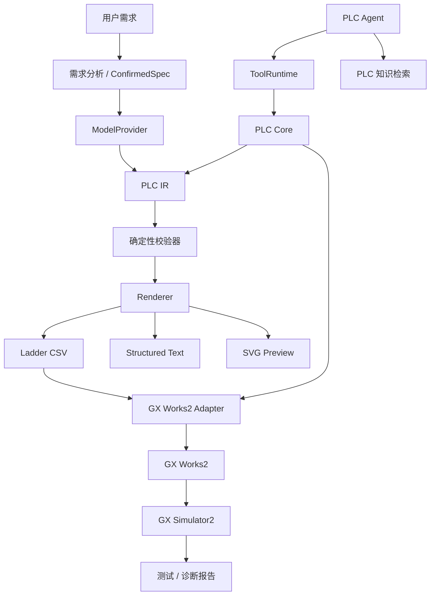

# GX Works2 Openness MCP

[English](README.md) | 简体中文

> 面向 Mitsubishi GX Works2 的 AI 辅助工程工作台。  
> **自然语言 → PLC 逻辑 → 校验 → GX Works2 → 仿真。**


GX Works2 Openness MCP 是一个面向 Mitsubishi MELSEC PLC 的实验性 AI 工程层。

它并不是让 LLM 直接输出一段 PLC 程序，然后“希望它能工作”，而是围绕模型建立一条完整的工程链路：

```text
自然语言需求
      ↓
需求澄清
      ↓
已确认控制规格
      ↓
PLC IR
      ↓
确定性校验
      ↓
Ladder / ST
      ↓
GX Works2
      ↓
GX Simulator2
      ↓
测试 / 诊断 / 修复
```

当前 Demo 主要聚焦于 **FX3U + GX Works2**。

> [!IMPORTANT]
> 这里的 `Openness` 指的是在 GX Works2 周围建立可编程的开放工程接口。
> 本项目**并不使用，也不声称提供 Mitsubishi Electric 官方的“Openness API”**。

---

## 为什么做这个项目？

现代 AI Agent 已经越来越擅长通过结构化工具操作工程软件。

但 GX Works2 本身并不是围绕 Agent 工作流设计的。

这个项目尝试补上中间缺失的这一层。

目标不是：

```text
Prompt → LLM → PLC 代码
```

而是：

```text
AI 推理
    +
结构化 PLC 状态
    +
确定性校验
    +
工程工具
    +
仿真反馈
```

让 PLC 程序的生成和修改真正做到：**可检查、可增量修改、可验证**。

---

## 功能

### 自然语言 PLC 工程

直接描述你需要的控制行为：

```text
X0 启动电机。
X1 停止电机。
Y0 驱动电机接触器。

需要自锁。
停止必须优先。
X2 检测到工件后，延时 3 秒停止。
掉电恢复后电机不能自动重新启动。
```

系统可以：

- 澄清不完整的控制需求
- 形成并确认控制规格
- 生成 Ladder 或 ST
- 修改已有程序
- 分析现有逻辑
- 诊断程序问题
- 提出针对性的修复方案

### PLC 中间表示（PLC IR）

LLM 输出不会被直接当作最终工程结果。

程序会被转换为内部的 **PLC IR**：

```text
             ┌─ Ladder CSV
             ├─ ST
AI → PLC IR ─┼─ SVG 预览
             ├─ Validation
             └─ GX Works2
```

PLC IR 提供稳定的语义层，用于描述：

- Network
- 指令
- 软元件
- 读写依赖
- 增量 Patch
- 程序 Revision
- 静态分析
- Diff
- 确定性渲染

这也为未来扩展以下能力提供基础：

```text
Structured Ladder / FBD
GX Works3
其他 PLC 平台
```

### 确定性校验

模型不会自己负责判断“自己生成的程序到底对不对”。

生成后的程序会在本地检查，包括但不限于：

- 指令结构
- 软元件合法性
- I/O 引用
- 定时器和计数器
- Network 结构
- 读写依赖
- PLC 特定约束
- 控制规格一致性
- 常见梯形图逻辑问题

```text
LLM
 ↓
PLC IR
 ↓
Validator
 ↓
Pass ─────→ Render / Import
 ↓
Fail
 ↓
Repair
```

> **LLM 负责推理，确定性代码负责验证。**

### GX Works2 集成

当前 Ladder 工作流使用 GX Works2 CSV 导入 / 导出作为稳定的工程接口。

当前支持：

- 程序 CSV 生成
- 软元件注释 CSV 生成
- GX Works2 导入
- GX Works2 导出
- 程序同步
- 注释同步
- 覆盖前自动备份
- 同步 Baseline
- 外部人工修改检测
- 冲突保护
- 可选 Round-trip Verification

```text
PLC AI
   ↓
生成 CSV
   ↓
备份 GX Works2
   ↓
检查同步 Baseline
   ↓
导入
   ↓
回读
   ↓
验证
```

如果系统检测到 GX Works2 程序在上次同步后被人工修改，它会停止自动覆盖，而不是静默抹掉这些改动。

### 增量修改

已有 PLC 程序不需要每次都从头重新生成。

Agent 可以生成局部 Patch：

```text
Current PLC IR
      ↓
Network Patch
      ↓
Candidate Version
      ↓
Validation
      ↓
Diff
      ↓
用户确认
      ↓
Commit
```

因此可以处理类似这样的请求：

```text
把停止逻辑改成停止优先。

不要修改其他 Network。
```

而不必重建整份程序。

### PLC Tool Agent

项目包含一套与模型供应商无关的 Agent / Tool 边界。

模型通过高层工程工具与项目交互，例如：

```text
get_current_project
get_current_program_info
read_network
search_plc_manual
get_diagnostics
validate_project
compile_project
patch_program
validate_current_program
import_current_program_to_gxworks2
```

模型**不会**直接获得以下底层原语：

```text
mouse_click
keyboard_input
delete_file
write_plc
force_device
```

真正的工程状态修改始终被限制在受控的应用边界之后。

### GX Simulator2 自动化测试

项目可以根据当前 PLC 程序生成仿真测试方案，并通过 GX Simulator2 自动执行。

```text
PLC Program
    ↓
AI Test Planning
    ↓
用户确认
    ↓
GX Simulator2
    ↓
输入序列
    ↓
断言
    ↓
测试报告
```

本地 Simulator Gateway 被刻意设计为与真实 PLC 隔离。

当前设计包括：

- 仅监听 localhost
- 每进程独立认证 Token
- 固定目标为 GX Simulator2
- 受控软元件写入
- 不提供连接物理 PLC 的路径

详见 [`simulator_gateway/README.md`](simulator_gateway/README.md)。

---

## 模型支持

内置 Agent 使用与厂商无关的 `ModelProvider` 抽象。

当前支持：

| Provider | 状态 |
| --- | --- |
| DeepSeek | ✅ |
| 智谱 GLM | ✅ |
| 自定义 OpenAI-compatible API | ✅ |
| Anthropic 原生 API | 🚧 计划中 |
| Gemini 原生 API | 🚧 计划中 |
| Codex Harness / App Server | 🚧 计划中 |

DeepSeek 和智谱目前共享同一个 OpenAI-compatible 传输层，而不是分别维护两套 Provider 实现。

API Key 保存在 Windows Credential Manager 中，不写入仓库配置。

---

## MCP

当前代码已经具备 MCP 风格的 Tool Runtime：

```text
Built-in Agent
      ↓
 ModelProvider
      ↓
 ToolRuntime
      ↓
   PLC Core
      ↓
GX Works2 Adapter
```

工具使用结构化 Schema，并通过统一的 ToolCall / ToolResult 对象交互。

下一步是把这套 Tool Runtime 暴露为独立 MCP Server：

```text
Codex ────────────┐
Claude Code ──────┤
DeepSeek Harness ─┼→ GX Works2 MCP → PLC Core → GX Works2
Other Agents ─────┘
```

计划中的传输方式：

- stdio
- Streamable HTTP

> 当前版本尚未向外部 MCP Client 提供独立的标准 MCP Server。

---

## 架构



---

## 快速开始

### 环境要求

推荐：

- Windows 10 / 11
- Python
- GX Works2
- DeepSeek、智谱或其他 OpenAI-compatible API

如需自动仿真，还需要：

- GX Simulator2
- MX Component

GX Works2、GX Simulator2 与 MX Component 均为 Mitsubishi Electric 的商业软件，本仓库不包含这些软件。

### 安装

```powershell
git clone https://github.com/Arienax/GX-Works2_Openness_MCP.git
cd GX-Works2_Openness_MCP

python -m venv .venv
.\.venv\Scripts\Activate.ps1

pip install -r requirements.txt

python src\main.py
```

运行测试：

```powershell
pytest -q
```

仓库还提供一套 Windows 7 兼容依赖：

```powershell
pip install -r requirements-win7.txt
```

---

## 项目结构

```text
src/
├─ main.py
│  桌面工程工作台
│
├─ model_provider.py
│  与厂商无关的模型抽象
│
├─ plc_agent.py
│  Tool-calling PLC Agent
│
├─ plc_agent_tools.py
│  工程工具定义
│
├─ tool_runtime.py
│  MCP-shaped Tool Boundary
│
├─ plc_core.py
│  与模型无关的 PLC 操作层
│
├─ plc_ir.py
│  PLC IR / Patch / Validation / Hash
│
├─ plc_json_validator.py
│  确定性 PLC 校验
│
├─ knowledge_retriever.py
│  PLC 手册 / 工程知识检索
│
└─ gxworks2/
   ├─ csv_manager.py
   ├─ import_service.py
   ├─ sync_service.py
   ├─ simulation.py
   └─ ui_automation.py

simulator_gateway/
└─ 本地 GX Simulator2 Gateway

resources/
├─ knowledge/
├─ pattern_library.json
└─ plc_models.json
```

---

## Roadmap

- [ ] 独立 MCP Server
- [ ] Codex Harness / App Server 集成
- [ ] DeepSeek Harness 集成
- [ ] Structured Ladder / FBD
- [ ] Function / Function Block
- [ ] 可复用 FB Library
- [ ] 更完整的 compile / diagnose / repair 闭环
- [ ] 更多 MELSEC PLC 系列
- [ ] GX Works3 Adapter
- [ ] Vendor-neutral PLC Backend
- [ ] HMI / 更完整的自动化工程模型

---

## 当前状态

本项目仍处于持续开发阶段。

当前限制：

- 主要围绕 FX3U 开发和测试
- Ladder CSV 集成目前是最成熟的后端
- Structured Ladder / FBD 尚未实现
- 独立 MCP Transport 尚未实现
- GX Works2 GUI 自动化可能受软件版本、界面语言和窗口状态影响
- Simulator 仿真验证不能替代真实设备调试与验收

---

## 安全说明

PLC 软件会直接控制物理设备。

在部署到真实机械设备之前，应由具备相应经验的工程人员审查生成逻辑。

尤其需要关注：

- 急停回路
- 机械互锁
- 极限位
- 回零逻辑
- 故障安全行为
- 上电初始状态
- 运动机构碰撞风险
- 驱动器 / 伺服参数

---

## License

本项目采用 [Apache License 2.0](LICENSE)。

---

## Disclaimer

This is an independent open-source project and is **not affiliated with, sponsored by, or endorsed by Mitsubishi Electric**.

Mitsubishi Electric、MELSEC、GX Works2、GX Simulator2 和 MX Component 等名称与商标归其各自权利人所有。
